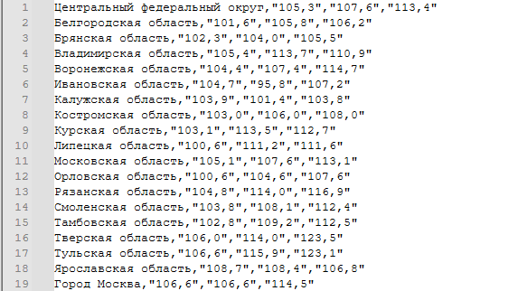
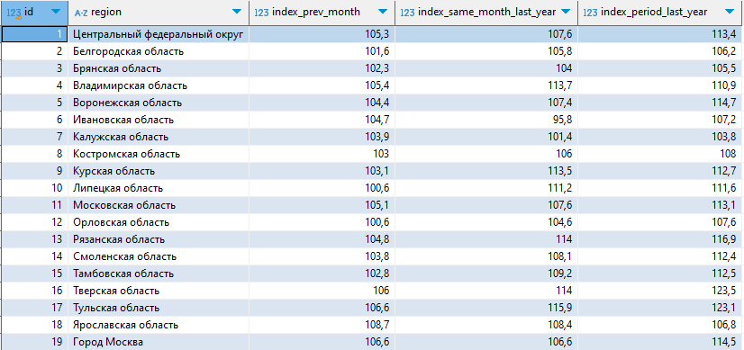

#  Моё тестовое задание

##  Описание проекта

Из динамического сайта BI росстата необходимо вытащить данные за определённый период. Данные хранятся в виде картинок, которые можно получать через библиотеку requests
Т.к сайт динамический -> необходимо каждый раз менять JSESSIONID и refer на актуальные.
Также желательно задать несколько user-agent-ов и проходится по ним.

После этого при помощи tesseract-а мы распаршиваем данные с картинки и далее через pandas собираем их в таблички и трансофрмируем в csv,
которые в дальнешем объединяем.

Также данные перекидываются в БД в download_in_db

##  Навигация по проекту

```
Папка picture_parsing:

- grid_parsing.py - извлекаем изображение данных с сайта: ВАЖНО указать ваш url, referer, JESSIONID, 
при необходимости можно добавить параметр Cookie в session.cookies.update

-regions_parsing.py - извлекаем изображение названий регионов, также указывая url, referer, JESSIONID, Cookie
```
```
Папка png:
Хранит в себе png файлы, которые получаем в результете отработки grid_parsing.py, regions_parsing.py 
```
```
Папка parsing_data:
ВАЖНО перед запуском должен быть установлен Tesseract: https://github.com/tesseract-ocr/tesserac ,
также необходимо прокинуть файл rus.traineddata для распознавания ru-текста: https://github.com/tesseract-ocr/tessdata

- parsing_city_names.py - Парсим данные названий городов с изображения, убираем аномалии, после чего
объединяем в одну табличкуи трансформируем в csv файл.
 
- parsing_dataset.py - Парсим числовые данные с изображения, проводя те же действия, что и в parsing_city_names.py

Результаты отработки в виде csv файлов сохраняются в папку csv_result
```
```
Папка csv_result:
Хранит в себе полученные csv файлы

- take_result.py - объединяет полученные csv файлы в один - result.csv

result.csv в нашем случае выглядит следующим образом:
```

```
Папка download_in_database:

- download_in_db.py - Переносим данные из result.csv в БД
```

## Как проверить данные в БД?

```
Хост: 171.22.117.31
```
```
Порт: 5432
```
```
База данных: main_database
```
```
Пользователь: guest
```
```
Пароль: 1ExgPksOwn4K
```
```
Даные лежат на схеме pictures_data

Для проверки:
SELECT *
FROM pictures_data.regions_data_table;
```
```
Результат в БД
```
